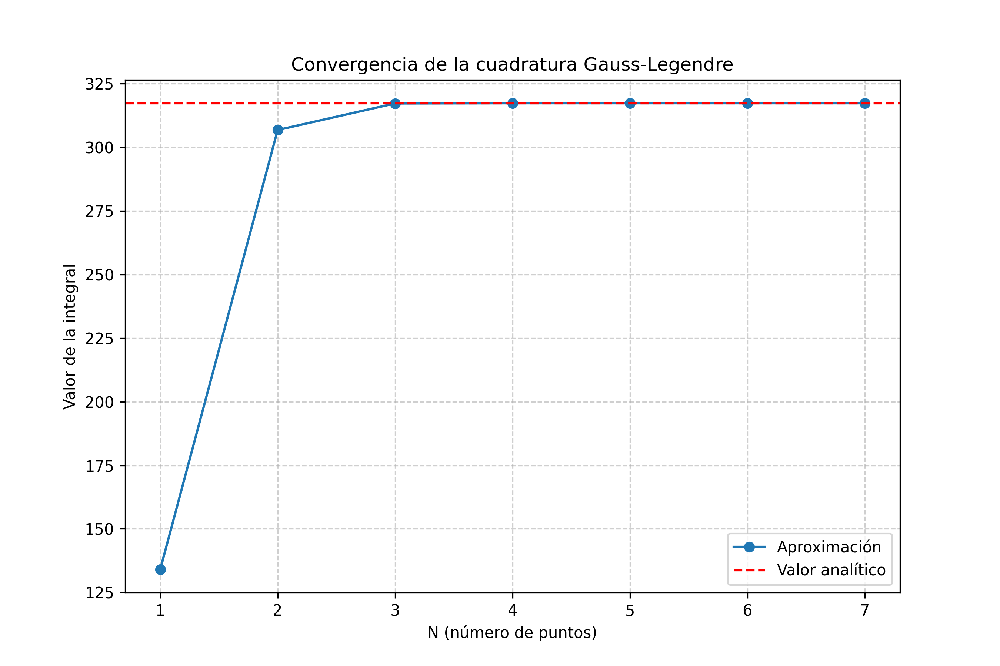
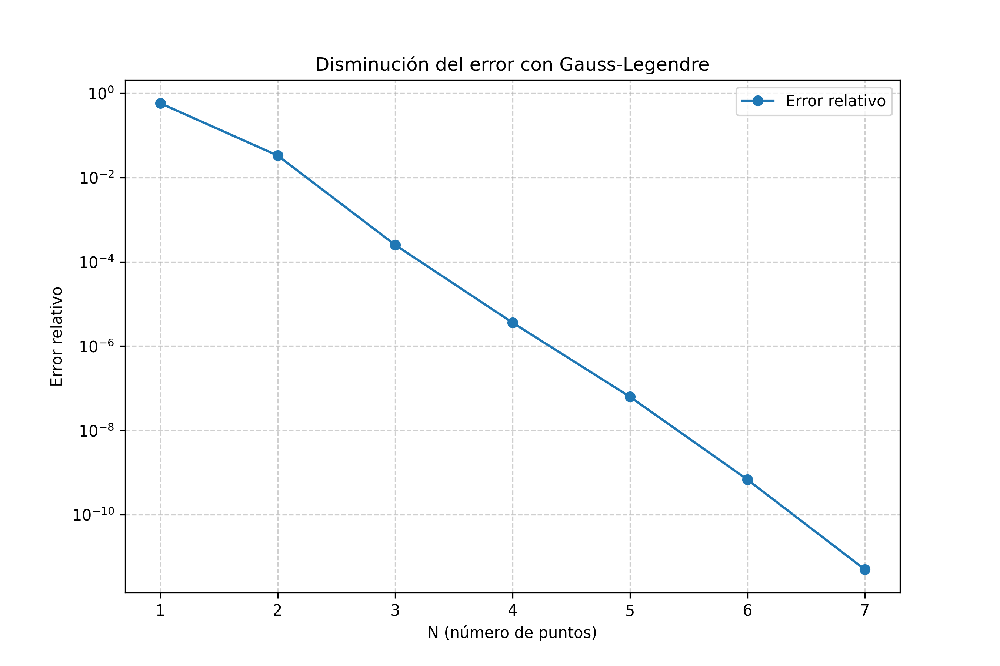

# Tutorial - Ejemplo de Uso

### Ejecutar el script desde el terminal

```bash
python cuadrature.py
```

Esto resuelve automáticamente la integral y genera los gráficos.

## Gráficos generados

Al ejecutar el script, se generan dos gráficos:






### Usar las funciones

```python
import cuadrature as cq

# Calcular integral con 5 puntos
pto, peso = cq.gaussxw(5)
pto_esc, peso_esc = cq.gaussxwab(1, 3, pto, peso)
resultado = cq.eva_int(pto_esc, peso_esc, cq.func_arg_int)

print(f"Integral: {resultado}")

# Comparar con valor exacto
exacto = cq.derivada_analitica(3) - cq.derivada_analitica(1)
error = abs(resultado - exacto) / exacto

print(f"Valor exacto: {exacto}")
print(f"Error: {error:.2e}")
```

### Resultado esperado

```
Integral: 317.344226721969
Valor exacto: 317.34424667382643
Error: 6.29e-08
```

